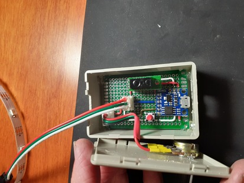
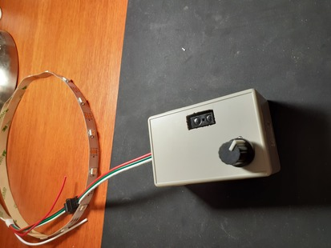
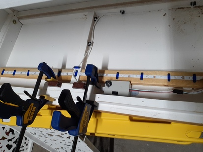

# Breakfast Nook Cabinet RGB LEDs

My current inspiration/project are some lights for a new cabinet we got for the kitchen. It's a strand of basic RGB LEDs driven by a Digispark (knockoff) ATTiny85 board. What makes it fun is the object detection sensor I use to turn the lights on and off. We can put our hand in, hold it there for a second, and then the lights switch off/on and cycle through patterns. Totally contact free.

There's also a potentiometer dial to set the brightness.

The main control board is a knockoff Digispark with the ATTiny85. The sensor is a Sharp GP2Y0D805Z0F digital distance sensor from Adafruit with about a 10cm range and the lights are a generic RGB LED ws2812b strip from BTF-Lighting.

The parts are mounted onto protoboard and affixed into a simple plastic work box.
For that box, a 6x4cm protoboard fits perfectly onto the internal standoffs and can easily be held in place with a little hot glue.

The RGB LED strand is kept in place with simple 3D printed brackets.
They're held down with wood screws on some furring strips added into the cabinet.
A few extra cable brackets and some cable ties for the USB power and it's all in good shape.

* * *

### Parts:

* [digiStump - Digispark creators](http://digistump.com/)
* [Digispark kickstarter](https://bit.ly/3a8Agz2)
* [ATTiny85 processor](https://www.microchip.com/en-us/product/ATtiny85)
* [Sharp distance sensor](https://www.adafruit.com/product/3025)
* [BTF Lighting Store](https://www.btf-lighting.com/)
* [Workbox case](https://www.aliexpress.com/item/2251832805778607.html?spm=a2g0o.order_list.0.0.3b641802NGxFao&gatewayAdapt=4itemAdapt)

* * *

Author: Aaron S. Crandall  
Contact: <crandall@gonzaga.edu>  
Copyright: 2022

* * *

